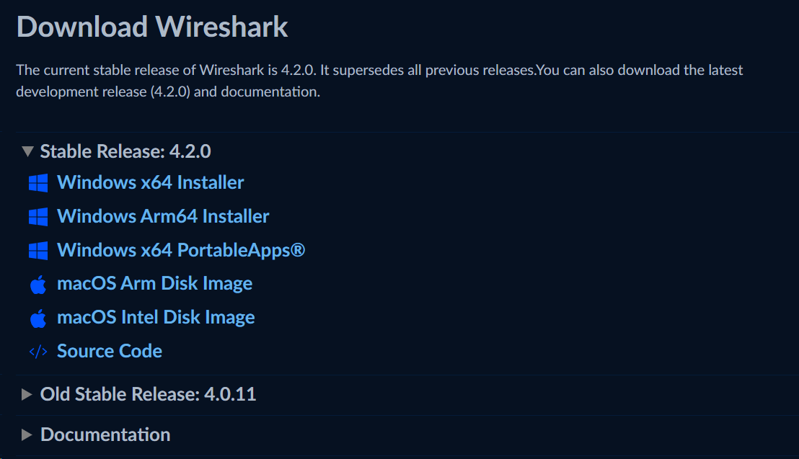
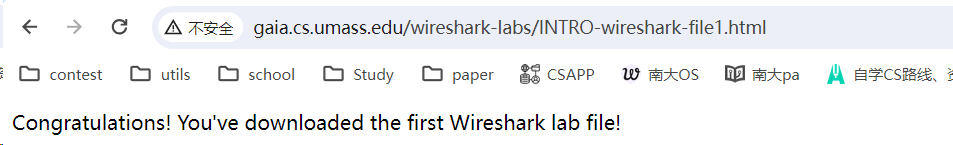
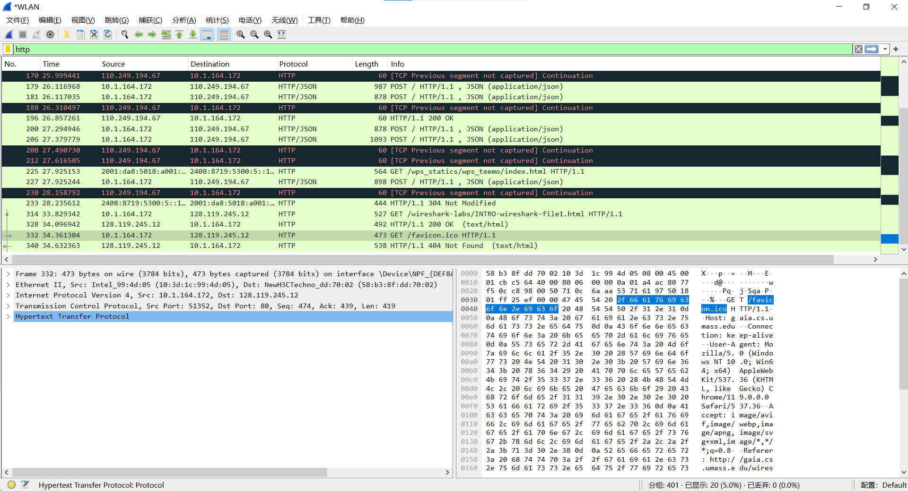

## WireShark Lab1

### Step 1. 下载WireShark

- 直接从[WireShark官网](https://www.wireshark.org/download.html)下载即可
- 
### Step 2

- 进入 WireShark

### Step 3. 测试捕获

- 在 WireShark 中选择接口进行捕获
- 在浏览器访问[地址](http://gaia.cs.umass.edu/wireshark-labs/INTRO-wireshark-file1.html)

### Step 4. 观察结果

- 浏览器显示输出之后
- 

- 进入 WireShark 中停止捕获
- 在 WireShark Commend Menu 的捕获框中 输入`http`进行捕获
- 

- 观察到`IP`地址为 128.119.245.12 的 HTTP 条目，即可完成实验

### 问题：

1. List 3 different protocols that appear in the protocol column in the unfiltered 

   packet-listing window in step 7 above. 

   - 包含的: TCP
   - UDP,

2. How long did it take from when the HTTP GET message was sent until the HTTP 

   OK reply was received? (By default, the value of the Time column in the packet

   listing window is the amount of time, in seconds, since Wireshark tracing began. 

   To display the Time field in time-of-day format, select the Wireshark *View* pull 

   down menu, then select Time *Display Format*, then select *Time-of-day*.)

   - Begin : 2023-11-20 17:23:39.947228
   - End   : 2023-11-20 17:23:40.750249

3. What is the Internet address of the gaia.cs.umass.edu (also known as www

   net.cs.umass.edu)? What is the Internet address of your computer?

   - Source : 10.1.164.172
   - Destination : 128.119.245.12

4. Print the two HTTP messages (GET and OK) referred to in question 2 above. To 

   do so, select *Print* from the Wireshark *File* command menu, and select the 

   “*Selected Packet Only”* and *“Print as displayed”* radial buttons, and then click 

   OK.
   
   - Congratulations!  You've downloaded the first Wireshark lab file!\n
   - GET /wireshark-labs/INTRO-wireshark-file1.html HTTP/1.1\r\n
